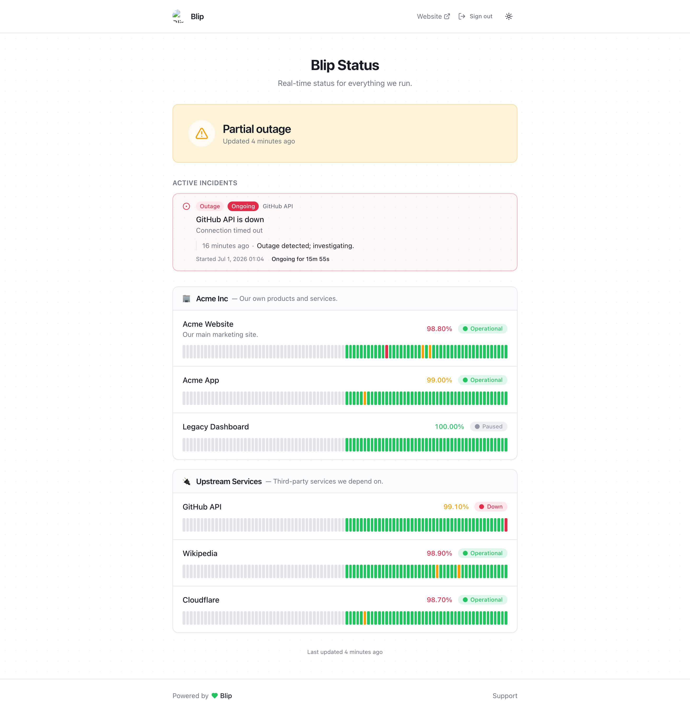
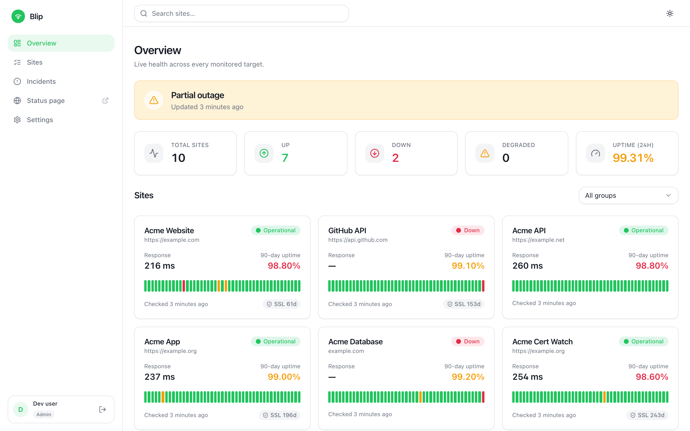
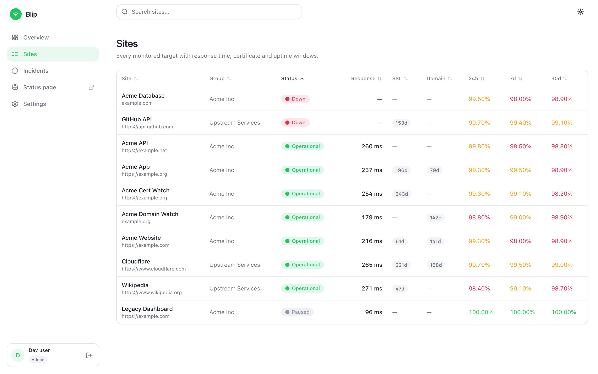
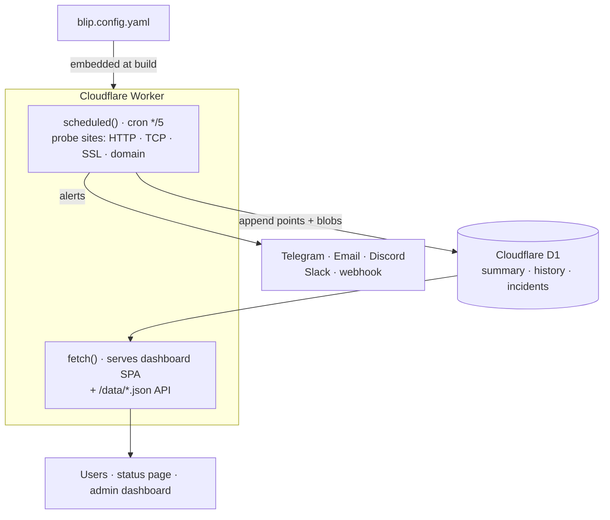

<div align="center">

# ⚡ Blip

### Free, serverless uptime monitoring & status pages — powered by Cloudflare Workers.
**$0/month. One Worker. No server to run.**

[](LICENSE)
[](docs/deployment.md)
[](packages/worker/README.md)
[](docs/faq.md)
[](.nvmrc)
[](CONTRIBUTING.md)


[Quick start](#-quick-start) · [Docs](docs/) · [Configuration](docs/configuration.md) · [Deploy](docs/deployment.md) · [FAQ](docs/faq.md)

</div>

---

Blip is a **single Cloudflare Worker** that monitors your websites, APIs, TLS
certificates, and domains on a cron trigger, stores results in **Cloudflare D1**
(managed SQLite), and serves a beautiful **React status page + admin dashboard**
straight from the same Worker. Built for agencies, teams, and homelabbers:
multi-tenant groups, RBAC, and client-scoped dashboards out of the box.

## ✨ Features

- 🆓 **Truly $0/month** — one Worker + D1 on Cloudflare's free tier. No server, no VM, no cron host, no database to run.
- 🌍 **External monitoring** every 5 minutes from Cloudflare's edge network.
- 🏠 **Monitor your homelab with no open ports** — reach LAN-only services through a Cloudflare Tunnel + Access service token. [Setup →](deploy/homelab-tunnel/)
- 🔎 **Rich checks** — HTTP status, keyword present/absent, **JSON-body assertions**, raw **TCP** ports, **TLS cert** expiry, and **domain** expiry.
- ⚡ **Fast dashboard** — React + Vite SPA with 24h / 7d / 30d / 90d graphs and incident history, served from the edge.
- 🏢 **Multi-tenant** — group sites by client/product/region.
- 🔐 **Built-in RBAC** — `SUPER_ADMIN` / `ADMIN` / `CLIENT` / `VIEWER`, password auth at the edge, with client-scoped views.
- 🔔 **Notifications** — Telegram, Email (Resend), Discord, Slack, and a generic webhook, with per-channel routing + flapping suppression.
- 🎨 **White-label ready** — your name, colors, logo on a custom domain.
- 🧩 **One typed config** — a single `blip.config.yaml`, validated against shared TypeScript types.

## 🖼️ Screenshots

### Public status page
A branded, standalone page you can share with users — grouped components and 90-day uptime bars.



### Admin dashboard
| Overview | Site detail |
|---|---|
|  |  |
| **Sites** | **Incidents** |
|  |  |

## 🏗️ Architecture



<details>
<summary>ASCII fallback</summary>

```
blip.config.yaml  (embedded into the Worker at build time)
      │
      ▼
┌──────────────── Cloudflare Worker ────────────────┐
│ scheduled() (every 5 min) ── probe sites          │
│      │                  │                          │
│  write to D1       send alerts → Telegram/Email/…  │
│      ▼                                             │
│ fetch() ── serves dashboard SPA + /data/*.json API │
└────────────────────────────────────────────────────┘
      ▼
Cloudflare D1 (managed SQLite) ── summary · history/<id> · incidents
      ▼
Users · status page · admin dashboard  (RBAC + password auth at the edge)
```

</details>

Full write-up: [docs/architecture.md](docs/architecture.md).

## 🚀 Quick start

```bash
# 1. Use this template → create your repo → clone it, then:
npm install

# 2. Generate your config interactively (brand, sites, channels)
npm run setup

# 3. Preview locally with realistic demo data
npm run seed && npm run dev      # → http://localhost:5173

# 4. Deploy to Cloudflare — one command does it all
npx wrangler login               # once
npm run deploy:cloud             # creates D1, sets secrets, deploys 🎉
```

`deploy:cloud` creates the D1 database and writes its id into `wrangler.toml`,
applies the schema, asks for your domain, generates the session key, prompts for
your admin password + any channel tokens, and deploys the Worker. The Worker then
probes every site on its 5-minute cron and serves the dashboard + status page
from the same URL.

> Handy commands: `npm run build` (build dashboard) · `npm run typecheck` · `npm test`.

## ⚙️ Configuration

Everything lives in one file, `blip.config.yaml`:

```yaml
version: 1
brand:
  name: Blip
  primaryColor: "#22c55e"
sites:
  - name: My Site
    url: https://example.com
    ssl: true            # watch TLS cert expiry
    domain: true         # watch domain expiry
  - name: My API
    url: https://api.example.com/health
    expectedStatus: 200
    keyword: "ok"        # body must contain "ok"
    expectJson:
      - path: "db.connected"
        equals: true
channels:
  - id: telegram-main
    type: telegram
    botToken: ${TELEGRAM_BOT_TOKEN}   # wrangler secret put TELEGRAM_BOT_TOKEN
    chatId: ${TELEGRAM_CHAT_ID}
    events: [down, up, ssl, domain]
```

Full reference (every field, every check type, every channel):
**[docs/configuration.md](docs/configuration.md)**. A complete annotated example
lives at [`config/blip.config.example.yaml`](config/blip.config.example.yaml).

## 🔔 Notifications

Five channels, each with `events` / `sites` / `groups` filters and
`minDownMinutes` flap suppression:

| Channel | Secret(s) |
|---------|-----------|
| Telegram | `TELEGRAM_BOT_TOKEN`, `TELEGRAM_CHAT_ID` |
| Email (Resend) | `RESEND_API_KEY` |
| Discord | `DISCORD_WEBHOOK_URL` |
| Slack | `SLACK_WEBHOOK_URL` |
| Generic webhook | your URL |

Setup for each (BotFather, Resend domain verification, webhooks) + the generic
payload shape: **[docs/notifications.md](docs/notifications.md)**.

## 🔐 Access control

Four roles — **`SUPER_ADMIN` · `ADMIN` · `CLIENT` · `VIEWER`** — configured under
`access:` in `blip.config.yaml` and enforced **by the Worker** with password auth
at the edge. Clients see only their own groups and sites. A public status page
(public sites only) can be served without login.

> 🔒 Details, principal/password setup, and how to put Cloudflare Access in front
> of the admin pages: **[docs/access-control.md](docs/access-control.md)**.

## 📊 How it works

1. **Probe** — every 5 min, the Worker's `scheduled()` handler checks each site.
2. **Store** — results are appended to **Cloudflare D1** and precomputed into JSON blobs.
3. **Notify** — state changes fan out to your channels.
4. **Serve** — the same Worker's `fetch()` serves the dashboard SPA and the `/data/*.json` API from D1.
5. **View** — users hit a fast status page + admin dashboard, behind RBAC.

Shared types in [`packages/shared/src/types.ts`](packages/shared/src/types.ts)
keep the Worker (writer) and dashboard (reader) in lockstep.

## 📈 Scaling limits

The 5-minute cron and Cloudflare's free tier set practical limits. Each tick
probes all sites within the Worker's CPU budget; slower SSL/domain probes are
cached and refreshed only every few hours:

| Sites | Recommended interval |
|-------|----------------------|
| ≤ 50  | 5 min                |
| ≤ 100 | 10 min               |

Need more? Raise the interval, or split across multiple Workers. The free tier
covers 100k Worker requests/day — far more than a 5-minute cron consumes.

## 🆚 Blip vs Upptime vs Uptime Kuma

| | **Blip** | Upptime | Uptime Kuma |
|---|:---:|:---:|:---:|
| Hosting model | **One Cloudflare Worker + D1** | GitHub Actions + Pages | **Self-hosted server** |
| Needs a server | ❌ | ❌ | ✅ |
| Cost | **$0** | $0 | Server cost |
| Monitor LAN/homelab (no open ports) | ✅ (Tunnel + Access) | ❌ | ⚠️ (needs the server on-LAN) |
| Multi-tenant groups | ✅ | ❌ | ⚠️ |
| RBAC (roles) | ✅ (4 roles) | ❌ | ⚠️ single admin |
| Client-scoped dashboards | ✅ | ❌ | ❌ |
| HTTP / TCP / SSL / domain checks | ✅ | ⚠️ | ✅ |
| JSON-body assertions | ✅ | ⚠️ | ⚠️ |
| Status page | ✅ | ✅ | ✅ |

⚠️ = partial / via plugins or workarounds. _Both Upptime and Uptime Kuma are
great projects — pick Blip when you want serverless **and** multi-tenant RBAC
**and** homelab monitoring without exposing ports._

## 🗺️ Roadmap

- [x] HTTP / TCP / SSL / domain checks
- [x] Keyword + JSON-body assertions
- [x] Multi-tenant groups + RBAC
- [x] Telegram / Email / Discord / Slack / webhook channels
- [x] Interactive setup wizard + demo seeder
- [ ] Maintenance windows (suppress alerts during planned work)
- [ ] Status-page subscriptions (email/RSS) for end users
- [ ] Per-incident public post-mortems
- [ ] Response-time SLO/percentile widgets
- [ ] More channels (Microsoft Teams, PagerDuty native, Opsgenie)
- [ ] Multi-region probes across Worker locations

Have an idea? [Open a feature request](.github/ISSUE_TEMPLATE/feature_request.yml).

## 🤝 Contributing

PRs and issues are very welcome! Start with **[CONTRIBUTING.md](CONTRIBUTING.md)**
and our [Code of Conduct](CODE_OF_CONDUCT.md). Good first steps: improve docs, add
a notification channel, or tackle a roadmap item.

```bash
npm install
npm run typecheck && npm test && npm run build   # what CI runs
```

## 📄 License

[MIT](LICENSE) © Blip contributors. White-label it, ship it to clients, make it
yours.

<div align="center">

**If Blip saves you a monitoring bill, give it a ⭐ — it helps a lot.**

</div>
